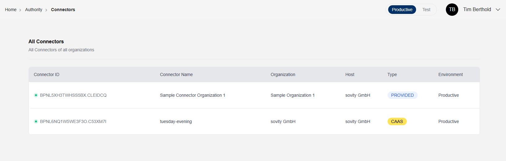

# Connector Overview

Under "All Connectors", Authority Users and Admins can see all registered connectors of all organizations in the Data Space Portal.
Also, the connector details can be accessed from here.

Additionally, the status of each connector is displayed, providing insights into their current operational state. Each Connector can have the following statuses:
- Online: The connector is reachable and operational.
- Offline: The connector is not reachable by the Data Space Portal crawler.

Connectors of type CAAS (Connector as a Service) can also support extended operational statuses. These additional statuses provide more granular insights into the state of Connector as a Service Connectors, reflecting their dynamic and managed nature.
- Init: The connector is in the initialization process.
- Provisioning: The connector is being set up and is not yet available for use.
- Deprovisioning: The connector is being decommissioned or removed.
- Error: An issue has occurred that requires attention.
- Unknown: Connector has been deleted via other systems and no longer exists. 

In rare cases, additional statuses may appear, reflecting specific scenarios or exceptions in the system's operation.

## Dashboard & Reporting

Additionally Authority Users and Admins have access to the following features on the Dashboard:

- They can download a report about all users and their roles.
- Instead of only their own, all connectors are respected in the connector report.
- Instead of only their own, they see the status of all connectors.
