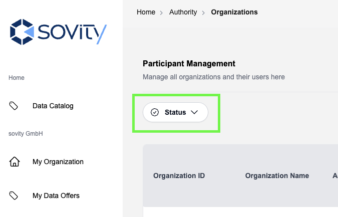
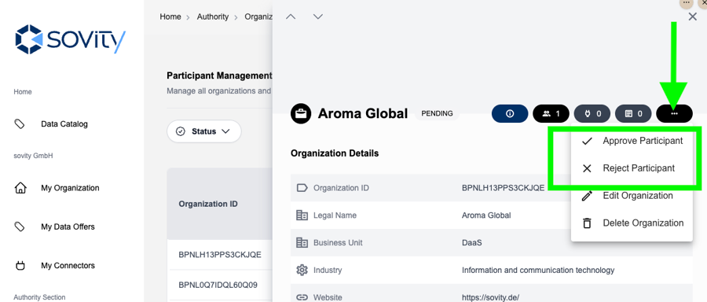

# Organization management

Organization management is only available to Authority Admins and Authority Users. If you have one of these application roles you can see the Authority section on the navigation bar.

On the Organization page you can see all organizations registered in the Data Space Portal. They can be filtered by their Status:

## Status Types

- "Active": Fully registered organizations
- "Invited": Organization invitation has been sent, but was not yet accepted
- "Onboarding": The Admin of an invited organization has already logged-in at least once and needs to fill in organization details
- "Pending": Organization has sent a registration request
- "Rejected": Organization registration request has been rejected

Click in the row of an organization to view the organization details. Quickly switch between two organization detail pages by using the arrows at the top left of the details view.

## Organization Details and Actions

On the organization detail page, Authority Users and Admins can manage the organization, review its information, and access a list of associated users.

### Available Details and Actions

- Organization Details (clickable):  Displays key information such as the legal name, description, and main address.
- Organization Members (clickable): Lists users associated with the organization, including their username, role, and status.
- Organization Connector Count: Shows the total number of connectors associated with the organization.
- Organization Data Offer Count: Displays the number of available data offers of the organization.
- Organization Actions: "Edit Organization", "Delete Organization" and in case of a newly registered organization: "Approve Participant" and "Reject Participant"

## Invite Organizations

Organizations can be invited by Authority Users and Authority Admins.
The process is as follows:

1. In the organization list, click on "Invite Organization".
2. Fill out the form with the organization details and the first user's details.
3. Submit the form. An email will be sent to the first user with a link to the user registration process.
