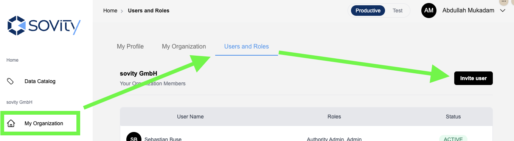

# Invite Users to DS Portal & sovity Hub

 We currently advise authorities to invite users to both the DS Portal and sovity Hub to ensure complete user experience between the DSPortal and the CaaS launched via the DSPortal. 

## Invite Users to DS Portal

**Use this section when you want user to only interact on the DS Portal.**

To invite new users into your organization, you must have the Organization Role Admin.

1. Click on the "Invite User" button in the top right corner of the "My Organizations" UI.

2. Following the instructions on the next screen
   - Specify the user's name, email and role.
   - Click on "Send invitation" to add the user to the list of registered users.

3. The invited user will receive an invitation email with a link. Until the user accepts the invitation, the user will have the "Invited" status on the DSPortal.

 We recommend that you encourage invitees to activate their accounts within the timebox for which the invitation link is enabled. For security reasons, the default timebox for the invitation link is 12 hours. We plan to increase this limit in the future. 

When clicking the invitation link, the user will be asked to set a password for their account and to set up two-factor authentication.

## Invite User to sovity Hub

**Use this section when you want users to also interact with Connector-as-a-Service (CaaS) for creating assets, policies and data offers.**

Please read the user guide on how to [invite members on sovity Hub](https://hub.docs.sovity.de/my-organizations/members#invite-members). 
