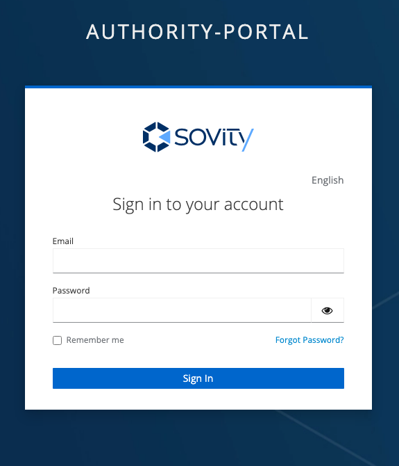

# Log In Page

 Before a successful login to the DSPortal, you must be invited to the DSPortal. Please contact the Authority Organization of the DS Portal or the admin of your respective organization.

The Log In page is powered by Keycloak page adapted to sovity's infrastructure.
* You can use your DS Portal credentials to log in.
* If needed, you can also reset your password.

