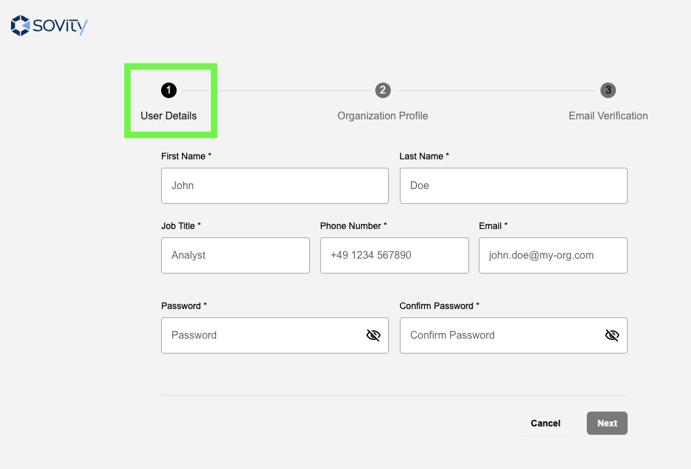
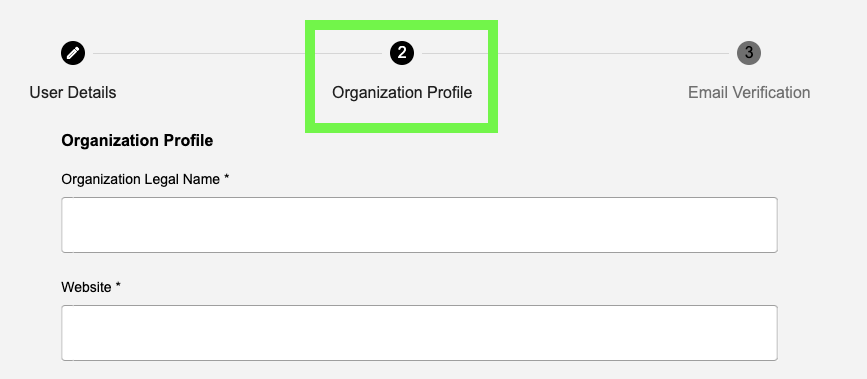
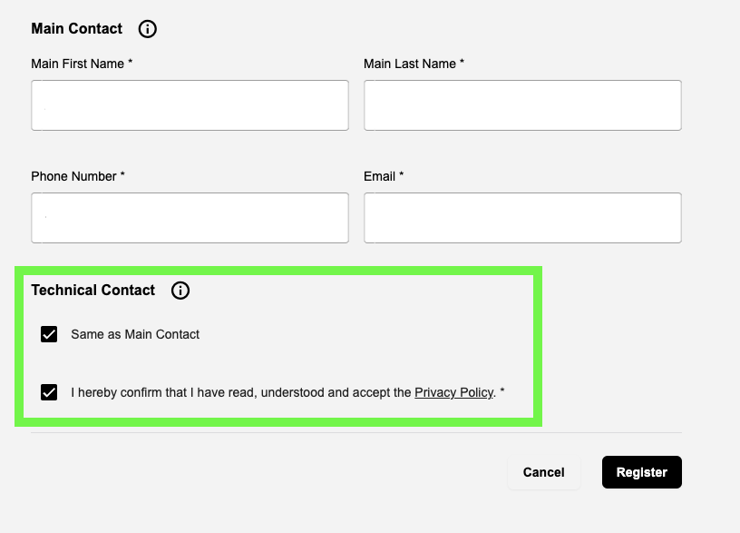
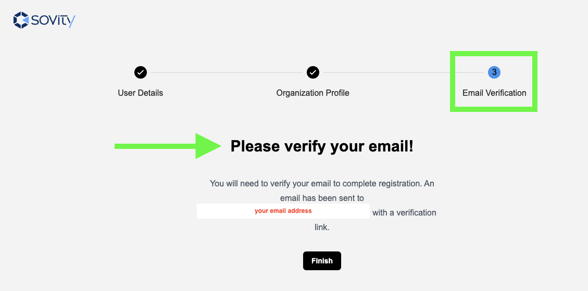
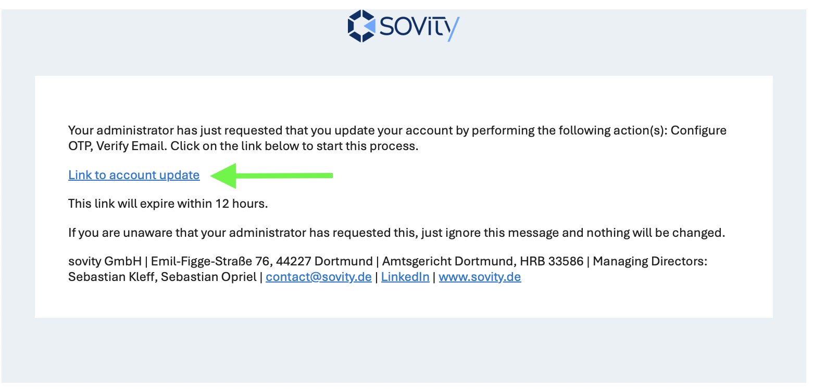
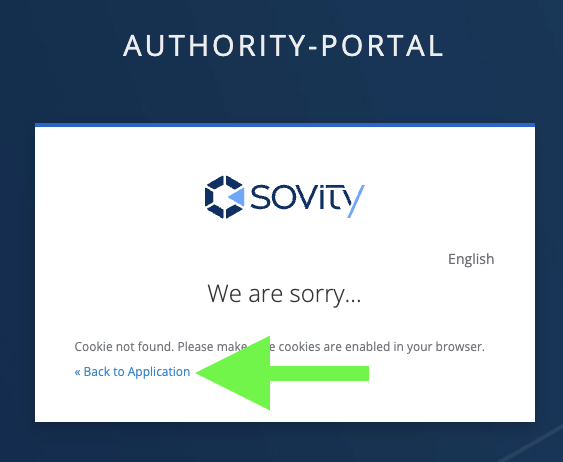

# Register Organization

The Register Organization page enables participating organizations to register themselves to the DSPortal. A participating organization can register itself in 3 steps.

## Step 1: Enter User Details

* The person acting as the administrator of the participating organization within the DSPortal enters their user details.

 We advise you to store your password in a trusted password management tool. You will need these credentials in Step 3 below. 

* Click on "Next"

## Step 2: Enter Organization Details

* The person acting as the administrator of the participating organization within the DSPortal enters the details of their organizations.

 Please provide accurate details as much as possible so that the DSPortal Authority and Participants can reach you if needed.  

* Please ensure that you tick these checkboxes at the end of this step

* Click Register

## Step 3: Email Verification

* You will be requested to verify your email address.
* Please check your email inbox for next activation steps.

 We advise you to take immediate actions on the email you receive so that you activate your DSPortal account soonest. 
  

* Please click on the activation link within the received email.

* You will be navigation to the MFA (Multi-Factor Authentication) page. Please follow the steps on the screen.
* You have now successfully activated your account! Please click on "Back to Application"

* Click on "Log In" and use the credentials you created in Step 1.
